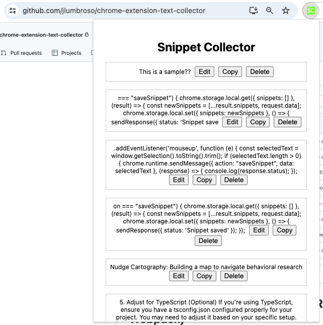
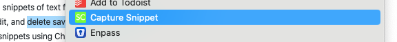

# Snippet Saver Chrome Extension (React, TypeScript, Webpack)

This project demonstrates how to build a Chrome extension using [React](https://react.dev/) with TypeScript and Webpack. It showcases key features such as interacting with Chrome APIs ([storage](https://developer.chrome.com/docs/extensions/reference/api/storage), [contextMenus](https://developer.chrome.com/docs/extensions/reference/api/contextMenus)), testing with [Jest](https://jestjs.io/) and [Sinon](https://sinonjs.org/), and structuring a React app with separation of concerns.

## Features

- Capture snippets of text from web pages using a [**context menu**](https://developer.chrome.com/docs/extensions/reference/api/contextMenus)
- View, edit, and delete saved snippets in a [**popup window**](https://developer.chrome.com/docs/extensions/reference/api/action#show_a_popup) triggered by an [**action button**](https://developer.chrome.com/docs/extensions/reference/api/action)
- Persist snippets using [Chrome's storage API](https://developer.chrome.com/docs/extensions/reference/api/storage)
- Interact with the extension using content scripts and background scripts
- Comprehensive testing setup using [Jest](https://jestjs.io/), [Sinon](https://sinonjs.org/), and [sinon-chrome](https://github.com/acvetkov/sinon-chrome/) for mocking Chrome API

## Screenshots

The first screenshot showcases the **popup window** with saved snippets and the **action button** (SC in the top-right corner):



The second screenshot shows the **context menu** that appears when you right-click on a web page to capture a snippet (this context menu is registered and its events are handled in the `background.js` script):



## Installation

### Install From Release

- Download the latest release from the [Releases](https://github.com/jlumbroso/chrome-extension-text-collector/releases)
- Unzip the downloaded ZIP file
- Open Chrome and navigate to `chrome://extensions`
- Enable "Developer mode"
- Drag and drop the unzipped folder into the extensions page

### Install From Source

1. Clone the repository:

   ```bash
   git clone https://github.com/jlumbroso/chrome-extension-text-collector
   ```

2. Install dependencies:

   ```bash
   cd chrome-extension-text-collector
   npm install
   ```

3. Build the extension:

   ```bash
   npm run build
   ```

4. Load the extension in Chrome:

   - Open Chrome and navigate to `chrome://extensions`
   - Enable "Developer mode"
   - Click "Load unpacked" and select the `dist` directory from the project

## Usage

- Right-click on a web page and select "Capture Snippet" from the context menu to save the selected text as a snippet
- Click on the extension icon to open the popup window
- In the popup, you can view, edit, and delete saved snippets

## Development

- Run the development server with hot reloading:

  ```bash
  npm run watch
  ```

- Load the unpacked extension in Chrome from the `dist` directory
- Make changes to the source code and the extension will automatically reload

## Chrome Extension Architecture

This project follows the Manifest V3 architecture for Chrome extensions. Key components of the architecture include:

- `manifest.json`: Defines the extension's metadata, permissions, and script configurations
- `background.js`: Runs in the background and handles events and long-running tasks
- `contentScript.js`: Injected into web pages to interact with the DOM and communicate with the background script
- Popup window: Displays the extension's user interface when the extension icon is clicked

### Manifest V3

This extension is built using the latest version of the Chrome extension manifest (Manifest V3). The `manifest.json` file defines the extension's properties, permissions, and scripts.

Key aspects of the Manifest V3 configuration include:

- `manifest_version`: Set to `3` to use Manifest V3
- `background`: Specifies the background script as a service worker
- `action`: Defines the popup HTML file
- `permissions`: Declares the required permissions for the extension (storage, activeTab, contextMenus)
- `content_scripts`: Specifies the content script to be injected into web pages

## Project Architecture

The project follows a modular architecture with separation of concerns:

- `App`: The main component that manages the state and renders the `SnippetList`
- `SnippetList`: Renders a list of `SnippetItem` components based on the saved snippets
- `SnippetItem`: Represents an individual snippet with options to edit and delete

The communication between the extension's scripts is handled as follows:

- `contentScript.js`: Injected into web pages, captures selected text and sends a message to the background script
- `background.js`: Listens for messages from the content script, saves snippets to storage, and manages the context menu

## Testing

The project includes a comprehensive testing setup using Jest, Sinon, and sinon-chrome. The tests cover various aspects of the extension, including component rendering, user interactions, and mocking of Chrome APIs.

To run the tests:

```bash
npm run test
```

To generate a coverage report:

```bash
npm run coverage
```

### Mocking Chrome APIs

One of the key aspects of testing a Chrome extension is mocking the Chrome APIs. This project uses the following libraries to achieve this:

- [Jest](https://jestjs.io/): The test runner and assertion library
- [Sinon](https://sinonjs.org/): A library for creating spies, stubs, and mocks
- [sinon-chrome](https://github.com/acvetkov/sinon-chrome/): A collection of pre-built mocks for Chrome APIs
- [jest-sinon](https://github.com/djkf/jest-sinon): An extension for Jest to work seamlessly with Sinon

Here's an example test that demonstrates mocking the Chrome storage API:

```typescript
it('sets initial state with empty array when snippets key is an empty array in local storage', async () => {
  chrome.storage.local.get.withArgs('snippets').yields({ snippets: [] });

  render(<App />);
  const snippetElements = screen.queryAllByRole('listitem');
  expect(snippetElements).toHaveLength(0);
});
```

In this test, we mock the `chrome.storage.local.get` method to return an empty array for the 'snippets' key. This allows us to test how the `App` component behaves when there are no saved snippets.

## Duplicating Project: Using This Project As A Starting Point

You are welcome to use this repository as a starting point for your own work. The best way to do so is to import the repository into your own GitHub account: You can do so either [using the GitHub Importer (recommended)](https://docs.github.com/en/migrations/importing-source-code/using-github-importer/importing-a-repository-with-github-importer) or [manually using the command-line](https://docs.github.com/en/repositories/creating-and-managing-repositories/duplicating-a-repository).

## Ideas for Enhancements

Here are a few ideas to enhance the functionality of this Chrome extension:

- Support rich formatting
- Implement syntax highlighting when selecting code
- Make it easy to copy a snippet to clipboard
- Add tags or categories to snippets for better organization
- Implement search functionality to filter snippets
- Allow users to export and import snippets as JSON files
- Integrate with a note-taking service or a cloud storage provider
- Add a feature to share snippets with others

## Credits

The initial setup of this project was based on the tutorial by [Harshita Joshi](https://github.com/Harshita-mindfire) on creating a Chrome extension with React and TypeScript. The corresponding Medium article can be found [here](https://medium.com/@tharshita13/creating-a-chrome-extension-with-react-a-step-by-step-guide-47fe9bab24a1).

The project has been extended with additional functionality, testing setup, and documentation. The most difficult part was figuring out the right combination of packages for the testing suite (for instance, I would avoid `jest-chrome`, `mockzilla`, `mockzilla-webextension`, to name but a few).
